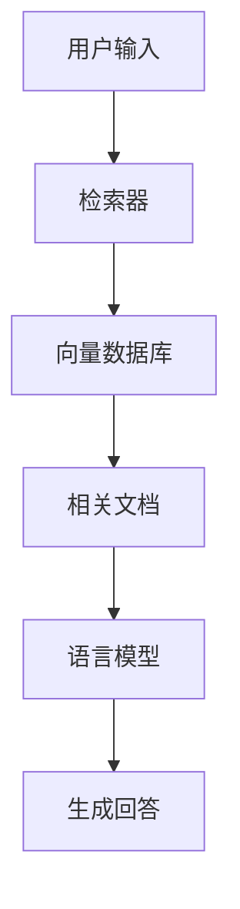

# 书籍 Markdown 模板

Phase 2 设计大纲、Phase 3 撰写内容时，参考此模板。

---

```markdown
---
title: [书名]
subtitle: [副标题]
topic: [调研主题]
author: 女娲炼书
date: [调研完成日期]
version: 1.0
readers: [目标读者]
depth: [快速概览/标准调研/深度专著]
sources_count: [来源总数]
---

<!-- 封面（PDF渲染时使用） -->

<div align="center">

# [书名]

### [副标题]

**[一句话核心价值描述]**

调研完成：[日期] | 信息来源：[N]条

</div>

---

<!-- 前言 -->

# 前言

## 为什么写这本书

[这个技术/概念为什么值得关注？它解决了什么问题？为什么现在了解它很重要？]

## 本书结构

[各部分的内容概览，用2-3句话描述每个部分]

- 第一部分「基础篇」：[描述]
- 第二部分「原理篇」：[描述]
- 第三部分「实践篇」：[描述]
- 第四部分「展望篇」：[描述]

## 读者指南

**前置知识**：[读者需要具备什么知识才能读这本书]

**阅读路径建议**：
- 想快速了解 → 读第1章 + 第11章
- 想动手实践 → 读第7-9章
- 想深入原理 → 读第4-6章

## 调研说明

本书基于 [N] 个信息源撰写，包括学术论文、官方文档、技术博客、开源项目和社区讨论。

调研时间：[起始日期] - [完成日期]
信息覆盖：截至 [完成日期]

**局限性**：
- [已知的局限1]
- [已知的局限2]

---

<!-- 正文部分 -->

# 第一部分：基础篇

# 第1章：[章节标题]

> [一句话点明本章核心价值]

## [节标题]

[正文内容]

### 技术术语首次出现格式

**术语**（English Term）：一句话定义。

例如：**检索增强生成**（Retrieval-Augmented Generation, RAG）：一种将外部知识检索与语言模型生成相结合的技术架构。

### 代码示例格式

```python
# 代码说明
from langchain.vectorstores import FAISS

vectorstore = FAISS.from_documents(docs, embeddings)
```

### 架构图格式（Mermaid）



### 对比���格格式

| 特性 | 方案A | 方案B | 方案C |
|------|-------|-------|-------|
| 性能 | ... | ... | ... |
| 复杂度 | ... | ... | ... |
| 适用场景 | ... | ... | ... |

### 来源标注格式

正文中的关键论点用脚注标注：

RAG最早由Lewis等人在2020年提出[^1]，核心思想是将检索模块与生成模块结合。

[^1]: Lewis, P., et al. (2020). "Retrieval-Augmented Generation for Knowledge-Intensive NLP Tasks." NeurIPS 2020. https://arxiv.org/abs/2005.11401

---

**本章要点**

1. [要点1]
2. [要点2]
3. [要点3]

**延伸阅读**
- 详见第X章：[相关章节]
- [外部资源名称](URL) — [一句话推荐理由]

---

# 第2章：[章节标题]

[同上结构...]

---

<!-- 重复以上结构直到所有章节完成 -->

---

<!-- 附录 -->

# 附录

## 附录A：术语表

| 中文术语 | 英文术语 | 定义 |
|---------|---------|------|
| 术语1 | Term 1 | 一句话解释 |
| 术语2 | Term 2 | 一句话解释 |

## 附录B：参考资料

### 第1章相关
1. [来源类型] [来源名称](URL) — [简短描述]
2. ...

### 第2章相关
1. ...

## 附录C：推荐阅读

精选最值得深入的资源：

1. **[资源名称]** — [推荐理由] ([URL])
2. **[资源名称]** — [推荐理由] ([URL])
...

---

> 本书由 [女娲 · 炼书术](https://github.com/alchaincyf/nuwa-skill) 生成
> 创建者：[花叔](https://x.com/AlchainHust)
```

---

## 撰写规范速查

### 术语处理
- 首次出现：**中文**（English）：定义
- 后续使用：直接用中文，不加英文
- 术语表收录所有专业术语

### 代码规范
- 围栏代码块必须标注语言
- 代码前用一句话说明用途
- 伪代码必须标注「以下为伪代码」
- 避免超过50行的代码块，长代码拆分并分段说明

### 图表规范
- 架构图 → Mermaid graph/flowchart
- 时序图 → Mermaid sequenceDiagram
- 流程图 → Mermaid flowchart
- 对比 → Markdown表格
- 数据展示 → Markdown表格
- 复杂图表 → 文字描述 + Mermaid辅助

### 引用规范
- 论文：作者, et al. (年份). "标题." 会议/期刊. URL
- 官方文档：[产品/项目名] 官方文档. URL
- 博客：[作者]. "[标题]." 博客名. URL
- 开源项目：[项目名]. GitHub. URL
- 不确定的来源标注为「据[来源类型]报道」

---

## 小白友好排版规范（面向普通读者时使用）

### Callout 块格式

增加视觉层次感，至少每 2 章使用一次：

```markdown
> 💡 **小贴士**：Hermes Agent 支持同时连接 Telegram、Discord、Slack 等 15+ 平台，你可以在不同平台无缝切换对话。

> ⚠️ **注意**：Hermes Agent 目前不支持 Windows 系统，需要通过 WSL2（Windows 子系统）使用。

> 📊 **数据**：截至 2026 年 4 月���Hermes Agent 在 GitHub 上获得了超过 43,000 颗 Star。

> **举个例子**：你让它帮你部署一个网站到服务器上。第一次，它���步步操作，花了 30 步。下次你再让它部署类似的网站，它已经"学会了"这个流程，直接调用技能模板，5 步搞定。
```

### 比喻解释格式

技术概念首次出现时，用生活化比喻：

```markdown
**上下文压缩**：就像你看一本书，看到第 100 页时忘了前面的内容。Hermes 会自动帮你做"读书笔记"——把前面的核心内容压缩成摘要，这样你既有上下文，又不会超负荷。

**模型路由**：就像一张"万能SIM卡"——不管你用的是移动、联通还是电信的套餐，插上就能用。Hermes 的模型路由器就像这张万能SIM卡，统一了不同 AI 模型的调用方式。
```

### 小白友好术语表格式

附录术语表用通俗语言解释：

```markdown
| 术语 | 通俗解释 |
|------|---------|
| **Agent** | AI 助手。不只是聊天，还能替你执行操作 |
| **Gateway（网关）** | Hermes 的"前台"，负责接收和转发消息 |
| **MCP** | 一个工具扩展标准，就像 USB 接口让电脑能连接各种外设 |
```

### 章节标题风格

面向普通读者时，用问句或口语化标题：

| 技术风格 | 小白友好风格 |
|---------|------------|
| 系统架构 | 它是怎么工作的 |
| 竞品对比 | 和同类产品比怎么样 |
| 挑战与局限 | 有什么不足 |
| 生态与工具 | 能连接哪些平台 |
| 部署实践 | 怎么安装和使用 |

### 内容精简规则（小白友好模式）

| 删除/简化 | 保留 |
|-----------|------|
| Issue 编号（改为"有用户反馈"） | 核心功能介绍 |
| PR 数量、测试用例数 | GitHub Stars 等关键数据 |
| Python 代码示例 | 终端命令示例 |
| YAML 配置块 | 流程图和对比表 |
| 详细安全分析（fail-open 等） | 简要安全提示 |
| 版本号细节 | 版本演进的简要故事线 |
